# Overview

Analyses are the results of running a bioinformatic workflow on sample data.

When an analysis is started, the sample data is run through a series of bioinformatic tools to produce a meaningful result that is made available to the user.

## Analysis Jobs

Analyzing sample data is the most computationally intensive task Virtool performs. It can take minutes or hours to run analyses for large, complex sample libraries.

Long-running analyses are therefore tracked under the **Jobs** tab.

From an analysis job, you can easily navigate to the analysis listing for the sample being analyzed.



## Caching

Sample data is automatically trimmed during analysis. Trimmed data are cached so that data doesn't have to be re-run.

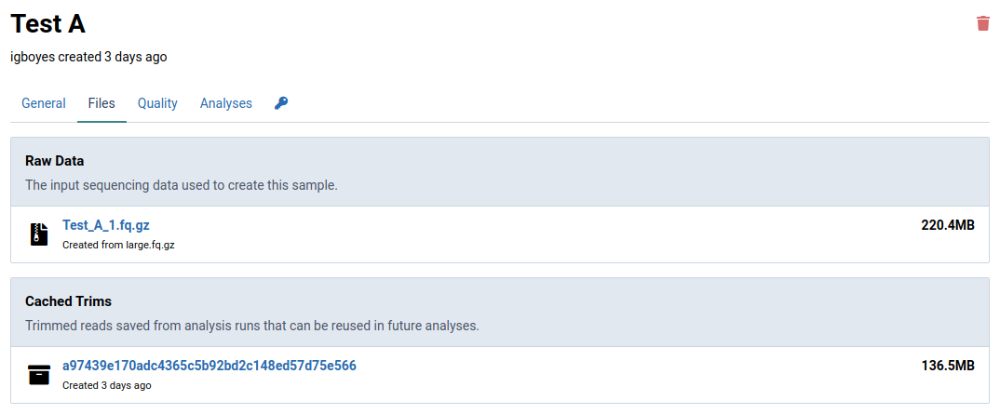

## Reference Versions

Analyses make use of [references](/docs/manual/guide/references) composed of pathogen sequences. Since references are modifiable and versioned, analyses are linked to specific versions of a reference. If a sample needs to be analyzed against newer version, a new analysis must be created.

Here is an example of a sample with multiple analyses using different workflows and different reference versions:

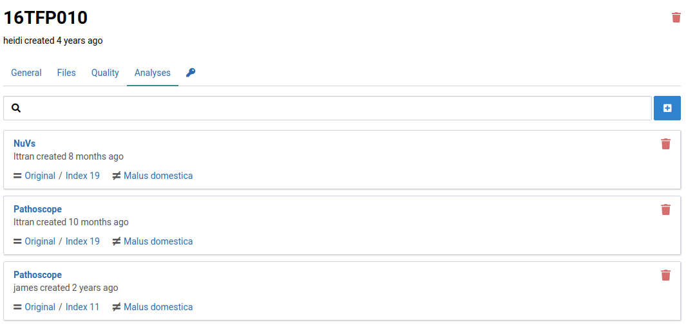

## Subtractions

Subtractions are sets of host or non-pest sequence data used to eliminate non-pathogen reads from analysis results.

You can read more about creating and managing subtractions from the links below:

-   [Subtraction Creation Tutorial](/docs/manual/tutorials/subtraction)
-   [Subtraction User Guide](/docs/manual/guide/subtraction)

# View Analyses

1. Navigate to a sample and click the **Analyses** tab

    

2. View the list of analyses

    This page will list all the analyses that have been created or currently running on your sample. The following image shows that one analysis has been completed.

    

# Create an Analysis

1. Navigate to the analyses list for a sample

    

2. Click on the  button to open the analyze dialog

    

3. Enter the analysis parameters

    Choose the analysis algorithm (PathoscopeBowtie or NuVs), the subtraction, and the reference you want to use to analyze your sample.

    

4. Click the  button to start the analysis

    Once the analysis is running, you can view its progress under the **Jobs** tab.

    

Multiple samples can be analyzed at once using the quick analysis feature. [Read more about quick analyses](/docs/manual/guide/samples).

# Delete an Analysis


**Analysis deletion is permanent**. There is no way to recover a deleted analysis.


1. Navigate to the analysis list for the sample whose analysis you want to delete

    

2. Click on the  icon on the analysis

    The analysis record will be removed from the list.

    

# Interpret Pathoscope

Pathoscope is the workflow in Virtool used for determining whether a known virus is present in a sample. A number of values are used to determine the presence of a pathogen.

Under the **Analyses** tab of your sample you will see a list of analyses that have been run on your sample. Click on the analyses you would like to view. You will see an analysis page such as the one below.
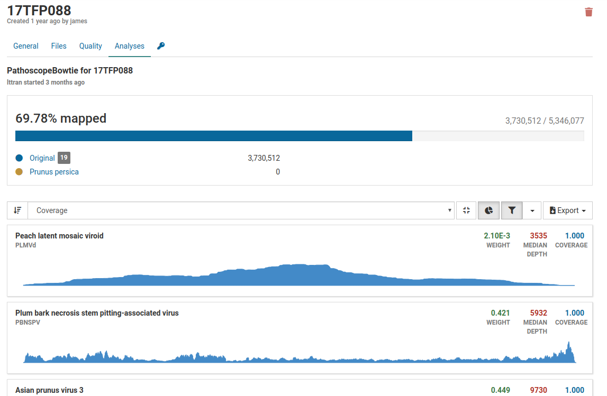

Generally, approximately 5 million reads is a good base line for a dsRNA library, however the percentage of mapped reads is of greater importance. For dsRNA, percentages can range from less than 1% to greater than 80%. The greater the enrichment of viral RNA and consequently the proportion of reads mapped, the lesser total reads are required. For example, 2% of 5 million reads or 100,000 mapped reads is good.

| Values   | Description                                                                                                                                                                                                        |
| -------- | ------------------------------------------------------------------------------------------------------------------------------------------------------------------------------------------------------------------ |
| Coverage | A measure for how well the mapped reads cover the viral genome. In general, coverage of greater than 0.5 indicates positive detection and coverage of less than 0.2 indicates negative detection.                  |
| Depth    | A measure of how many times a genome is covered by mapped reads                                                                                                                                                    |
| Weight   | The calculated proportion of reads mapping to a virus. The weight is roughly proportional to the titre. Higher the titre, higher the weight. A weight greater than 0.001 is strong indicator of positive detection |

## High Quality Positive

After running Pathoscope, the analyses tab will list all viruses Virtool thinks are likely to be in the sample. In our example, one viroid and four viruses are likely to be in the sample.

By default, pathogens with low coverage or weight (relative abundance) are filtered out. These pathogens can be made visible by clicking the  button.

For this example we will focus on the five pathogens that have the greatest coverage.

The section on top of the list of pathogens gives a quick overview of the total and mapped reads in the sample.

In this sample, we have over 5.3 million total reads and over 3.7 million mapped reads (69.78% mapped reads), illustrating that we have a good enrichment of viral RNA.

The values for weight, depth, and coverage are all very high therefore we can be confident that indeed these pathogens are present in the sample.

Clicking on a pathogen will show sequencing coverage charts for the isolates that may be in your sample.
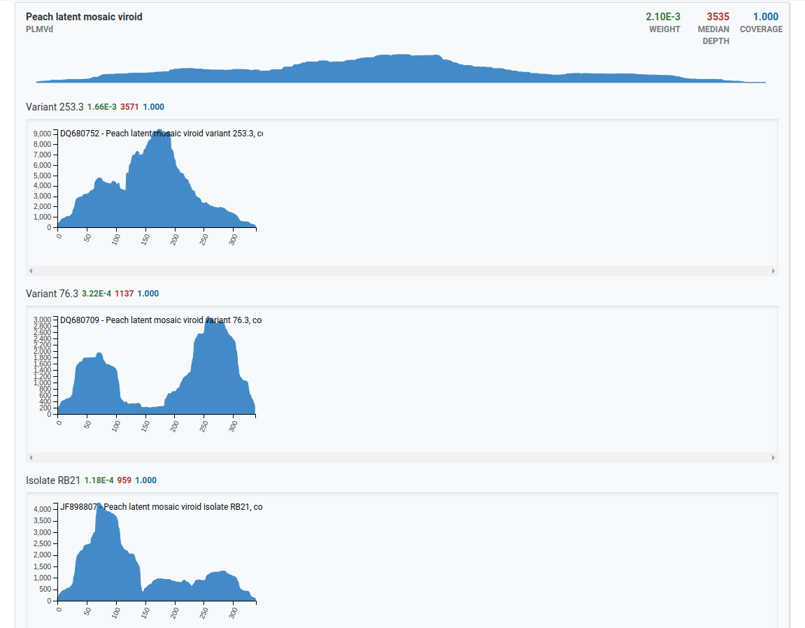

In the top example, there are three isolates for the Peach latent mosaic viroid that are present in the sample. The x-axis represents the genome size and the y-axis represents the number of reads.

In the above image, only two isolates from the Plum bark necrosis stem pitting-associated virus are present in the sample. Notice that viruses have larger genomes than viroids therefore the x-axis runs a greater distance covering the entire distance of the virus genome.

## High Quality Negative

The image below is an example of an analysis from a healthy sample.
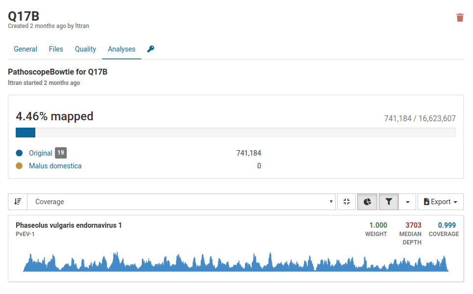

The only virus that is present in the sample is Phaseolus vulgaris endornavirus 1. This virus was intentionally introduced into the nucleic acid extraction as a positive internal control to verify that the extraction succeeded.

When we filter our results we see that all other viruses have low weight, depth, and coverage, assuring us that these are not present in the sample. With these results in mind, we can confidently say that this sample is from a healthy plant.

## Analysis of Contaminated Sample

Below is an example of an analysis from a contaminated sample.
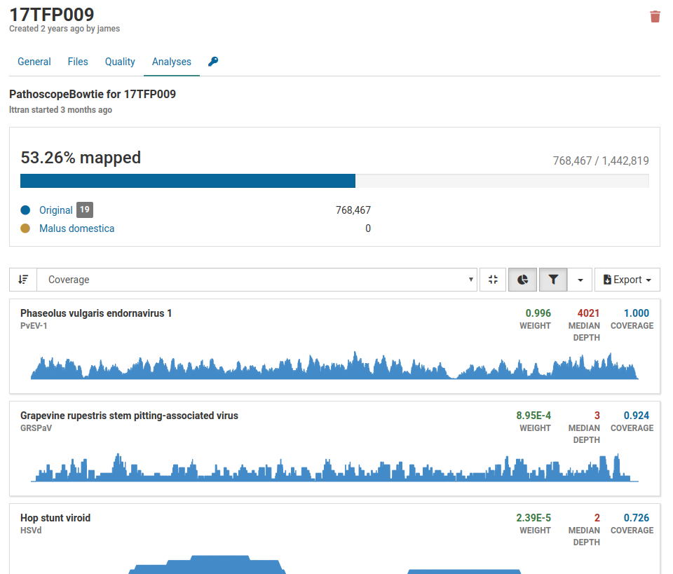

Although we have a large number of mapped reads that cover 53.26% of the viral genome, we see that the majority of the pathogens listed are associated with grapevines. Grape viruses are usually not found in tree fruits therefore this is likely a case of contamination.

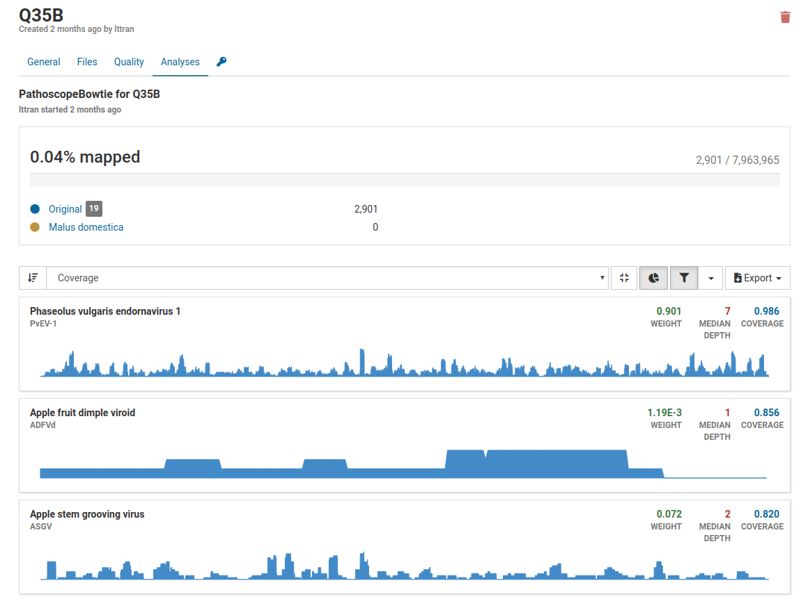

In this example above, only 0.04% of reads are mapped to the total number of reads therefore it is highly unlikely that the pathogens listed are actually present in the sample. Although weight and coverage are high, no sample has a high depth value. This is likely a sample of low quality.

Additionally when we take a look at the isolate coverage charts we see that the maximum depth is 14. This is very small compared to the maximum depth in a high quality positive sample which reaches a range in the thousands.

# Interpret NuVs

NuVs is a novel workflow used for discovering potential novel viral sequences in a sample library. The steps in the workflow are:

-   Eliminate known viral and subtraction reads
-   Assemble sample reads into long sequences called _contigs_
-   Predict open reading frames (ORFs) in the contigs
-   Scan the translated ORFs for viral protein motifs using a collection of profile hidden Markov models (HMMs)

Under the **Analysis** tab click on the NuVs analysis you would like to view. You will see a result viewer like the one shown below.
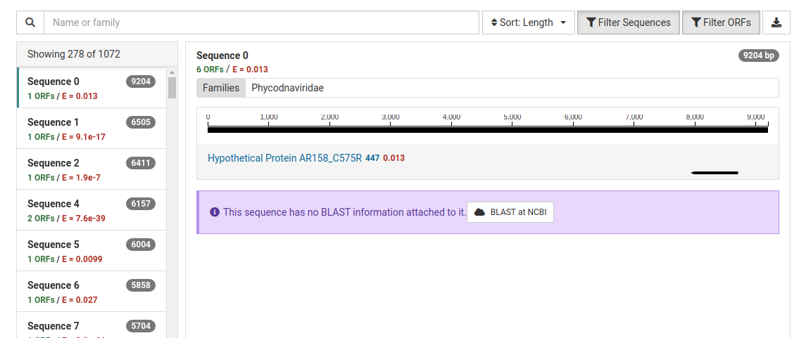

The NuVs output includes a contig count as a list of numbered sequences. For each sequence there are three values:

| Value   | Description                                                                   |
| ------- | ----------------------------------------------------------------------------- |
| Length  | Number of base pairs in the sequence                                          |
| E-value | The probability that an ORF in the contig matches a known viral protein motif |
| ORFs    | The number of open reading frames predicted in the contig                     |

A list of the assembled contigs is shown in the left pane. By default, contigs with no ORFs with significant HMM matches are not shown. This can be toggled using the  button. In our example, out of the 1072 assembled contigs, only 278 contained ORFs with significant HMM matches.

Clicking on a contig in the left pane will display a detailed view for the contig in the right pane. The contig is display as a black line with the ORFs identified underneath. By default, ORFs with no significant HMM matches are not shown. This can be toggled using the  button.

For ORFs with significant HMM matches, the size of the ORF and the E-value of the match is shown. The taxonomic families associated with the HMM data are also display above the graphic. An example of sequence 37 and its protein motifs is shown below.

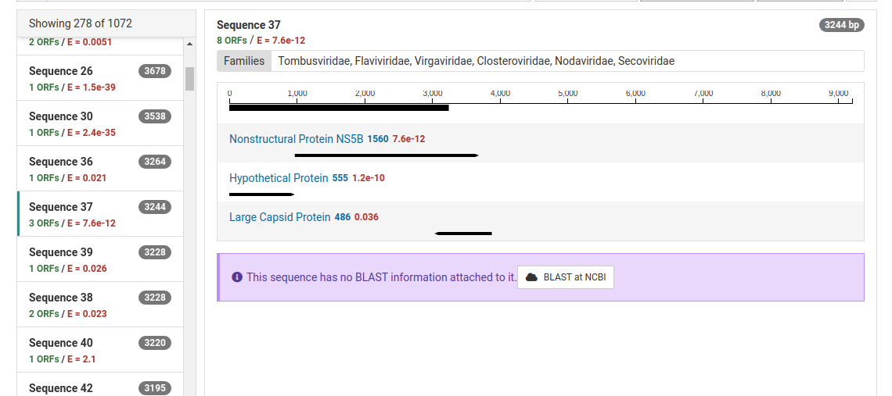

Contigs can be sent to NCBI for a BLAST search by clicking the  button. Many contigs derived from known viruses or non-viral sources will be assembled. It is necessary to BLAST significant contigs to ensure they are novel.

## Good Result

When a BLAST search is completed, a result table will be shown below the contig graphic. This table states the E-value, score, and identity of the viral sequences found on NCBI.

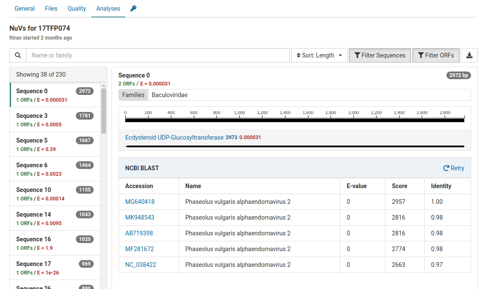

The E-values, score, and identities in the BLAST results indicate high quality matches. Knowing this we can interpret that these contigs do not represent novel viral genomes. However, they do not exist in our reference database in Virtool because they were not eliminated during the initial subtraction step of the NuVs workflow.

This sample contains Phaseolus vulgaris endornavirus as an internal control introduced during nucleic acid extraction. This explains the identification of Phaseolus vulgaris alphaendornavirus 2 in the sample.

Another contig has the following BLAST results:

The high E-value for the HMM match (0.39) indicates the capsid protein match is quite tenuous.

Additionally the BLAST results show that the contig is strongly related to _Prunus dulcis_ (almond). The E-values for all accessions are zero and the scores and identities are relatively high.

This sample is from a _Prunus_ host. The most likely source of this contig is the host genome.

This interpretation assumes that the _Prunus dulcis_ sequences used to build the HMM reference are actually from the host. It is important to bear in mind that reference databases are not reliable and may contain viral nucleotide and protein sequences mis-annotated as originating from the host.

## Suspicious Result

The result view below suggests a potential novel virus.

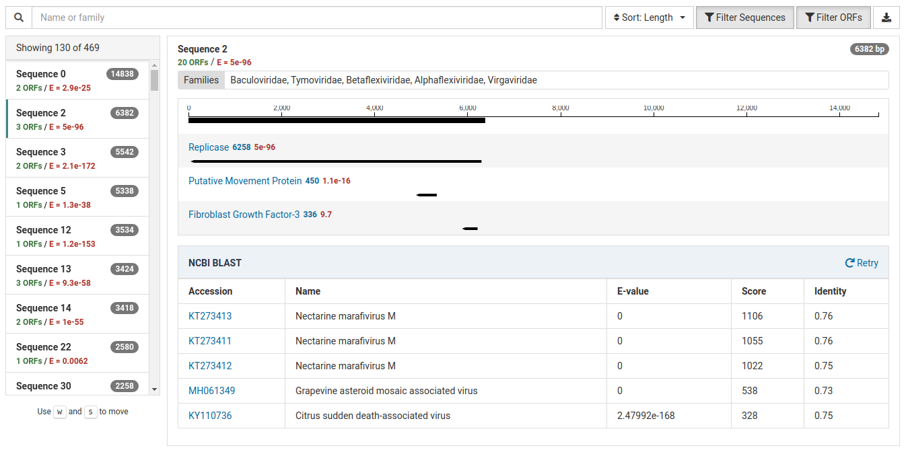

The HMM match has a very low E-value of 5e-96 indicating a strong match.

The NCBI BLAST results suggest that this contig could represent a novel virus. There are significant BLAST hits to known viruses (eg. Nectarine marafivirus M), however the identities are low (0.73 - 0.76). This low identity suggests that this contig may represent a virus the is novel but significantly dissimilar to related known viruses.

Additionally, this sample is isolated from a _Prunus_ host and Nectarine marafivirus M is not known to infect _Prunus_ species. Because the size of the sequence is large (6382 bp) it is worth assembling to discover more about the viral genome.

## Non-viral Result

This contig represents likely bacterial contamination from the field or laboratory:

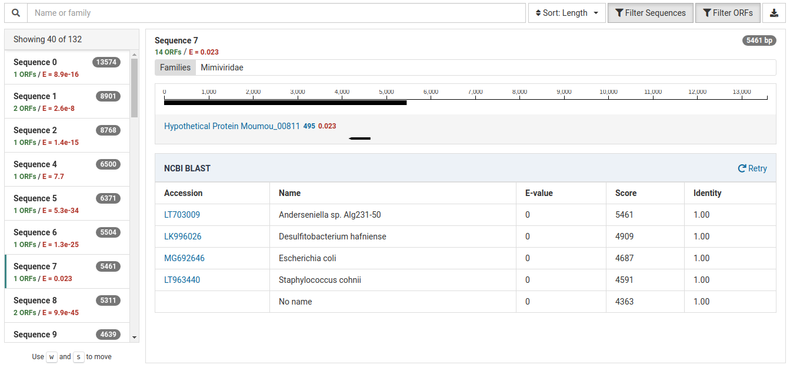

The BLAST results for this contig show hits for several bacterial species all with identities 1.00. Based on their scores, they are all very similar matches. Knowing that these bacterial species are not commonly found in plants, specifically in _Malus_, this is most likely a case of contamination.

The following contig demonstrates contamination from a lab technician or field collector:

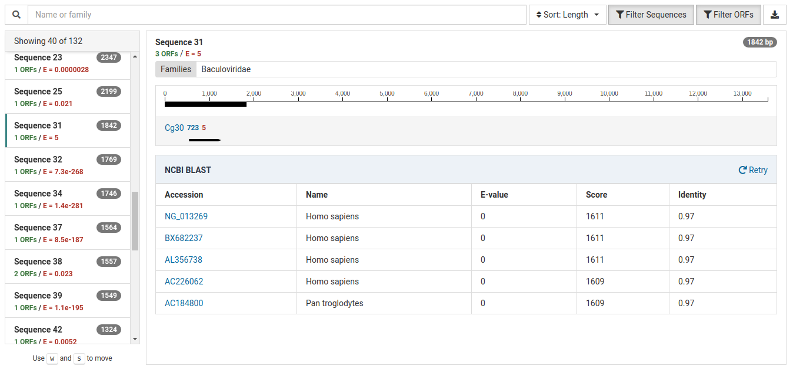

The E-value for the HMM match is very weak indicating that the annotation is very unreliable.

Further, the BLAST results for this contig reveal strong matches to _Homo sapiens_ (human) and _Pan troglodytes_ (chimpanzee). Given this information, this is very likely a case of human contamination.

## Next Steps

If a suspicious result is found during interpretation of NuVs results, it is important to further characterize the sequence using other bioinformatic tools and the help of a bioinformatician. NuVs makes a best effort to detect **potential** novel viral sequences in an automated manner. Further manual work is almost always required to produce a full-length genome sequence.

In the common case that new variants of known viruses are found, adding them to a virus reference in Virtool will be beneficial for future runs using Pathoscope. Doing so will save time analyzing data as more sequence information will be available and will also present users with more accurate results.
