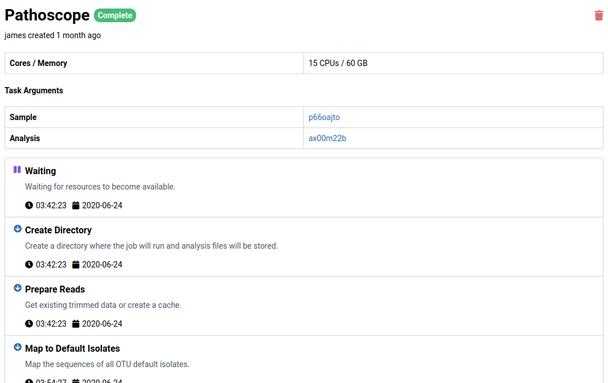

# Introduction

Jobs represent long running, resource-intensive processing tasks. All job types are related to analyzing and handling bioinformatic data.

| Type               | Description                                                      |
| ------------------ | ---------------------------------------------------------------- |
| Build Index        | Build a new index for a reference                                |
| Create Sample      | Create a sample from uploaded FASTQ data                         |
| Create Subtraction | Create a new subtraction from an uploaded genome FASTA           |
| NuVs               | Run a NuVs analysis for a sample and reference combination       |
| Pathoscope         | Run a Pathoscope analysis for a sample and reference combination |

Jobs are started when a task is started in another view (_eg_. sample creation dialog). New jobs are appended to the job queue and start as resources become available.

# List Jobs

1. Navigate to **Jobs** in the top navigation bar

    

2. View the jobs list

    The jobs list shows all waiting, running, and finished jobs. Jobs can be [cancelled](#cancel) and [deleted](#delete) from the list view.

    

# View Detail

1. Click on a job in the jobs list

    

2. View detail information for the job

    This view shows the computing resources used by the job, the arguments used for the job, and the the progression of steps in the job or workflow.

    

# Cancel a Job {#cancel}

Running and waiting jobs can be cancelled. Cancellation entails forcibly stopping the job process and cleaning up any partial job data from the database and file system.

1. Click the  icon on the job item

    The job will switch to a cancelled state and will release its resources and clean up any partial data.

    

# Delete a Job {#delete}

Once a job is finished, either by completing, encountering an error, or being cancelled, its record can be deleted.

1. Click the  icon on a job item to delete a job

    

2. Jobs can also be deleted via their detail page by clicking the  icon

    
