# Manual Setup

It is possible to configure Virtool without completing the graphical setup process.

Passing the `--no-setup` argument when running Virtool will skip the setup process and use default configuration values or values from [manual configuration sources](/docs/manual/gs_configuration/).

# Run

1. After installing Virtool, issue the following command in the Virtool install directory

    ```shell
    ./run
    ```

    This will start the application server.

    Use `./run --help` to see an overview of additional command line arguments Virtool can accept or read the [configuration documentation](/docs/manual/start/configuration).

2. Visit the application in the browser at [localhost:9950](http://localhost:9950)

    By default, the server listens on port `9950`. When you visit this address for the first time, you will have to complete a one-time setup. This will allow you to configure the essential settings required for Virtool to run.

    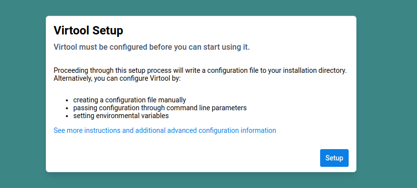

3. Click the  button to start setting up Virtool

# Connect to a Proxy

**You can skip this step if you don't use a proxy**. If you connect to the internet through a proxy, you can configure it here.


HTTPS proxies are not currently supported.


1. View the proxy configuration dialog

    You can enter the address for a proxy server through which Virtool should access the internet.

    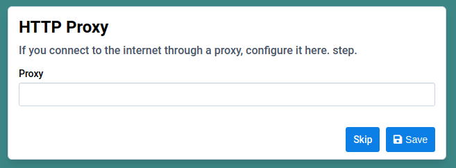

2. Enter the address of a proxy server

    We are using a [Squid](http://www.squid-cache.org/) proxy server running locally as an example.

    

3. Click the  button

    Virtool will attempt to connect to the internet using the provided proxy. Errors will be returned if there is an issue connecting or authentication with the proxy server.

    You should see something like this if the connection is successful:

    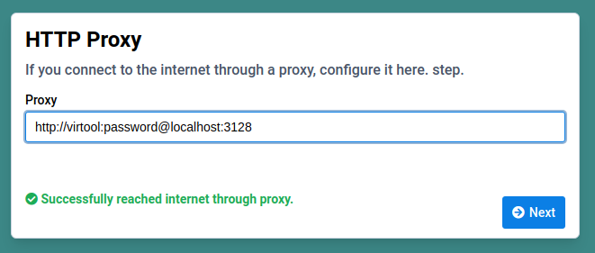

# Connect to MongoDB

MongoDB must be [installed and running](setup.md#MongoDB) before you can use Virtool.

Once MongoDB is ready, you can configure a connection to it using a [MongoDB connection string and database name](https://docs.mongodb.com/manual/reference/connection-string). When setup is complete, a new database will be created using the provided name.

1. Review the MongoDB setup dialog

    The placeholder values can be used by clicking  without changing the form. You can also specify a different address, authentication, or authentication database for your connection by changing the connection string.

    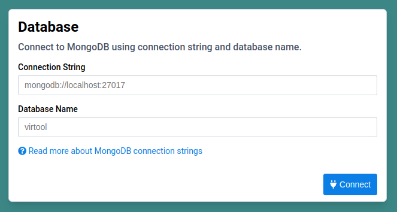

2. Fill in the form with your own MongoDB connection parameters

    Here, we changed the default database name to `virtool-2`. Virtool will return an error if there is already a database with the provided **Database Name**.

    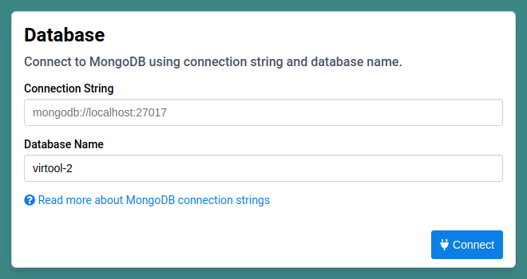

3. Click the  button

    You will see something like the following when the connection is successful:

    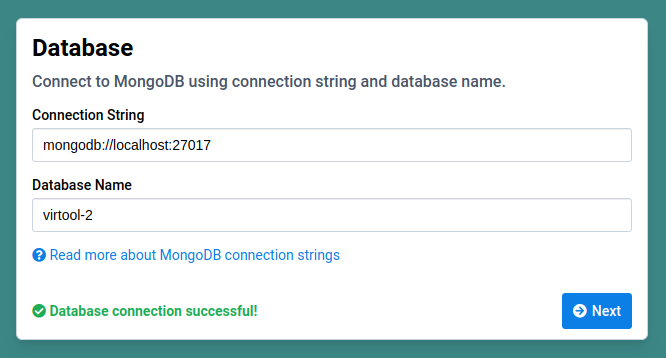



We highly recommend enabling authentication for MongoDB.

The MongoDB connection string is stored in plain text in the application configuration file. [Configure Virtool using environmental variables](/docs/manual/start/configuration) to keep your connection string safe.



# Set Data Location {#data_path}

The data location is where Virtool stores application data including uploaded Illumina libraries, imported sample data, and reference indexes. The path should be located on a storage device that offers good speed, capacity, and redundancy.

1. Review the data location setup dialog

    By default the path will be set to `data` and will be created in the Virtool installation directory. This configuration should only be used for testing purposes. Use a path on a separate RAID volume or network attached storage (NAS) to store data securely.

    Paths beginning with `/` will be assumed to be absolute paths. All other paths will be interpreted relative to the Virtool installation directory.

    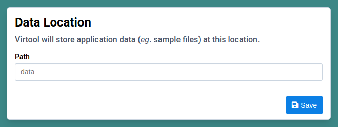

2. Set a data location of your choosing

    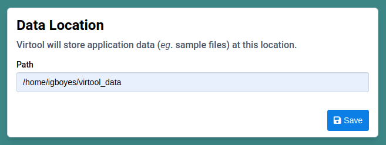

3. Click the  button

    When the data path has been successfully configured, you should see something like this:

    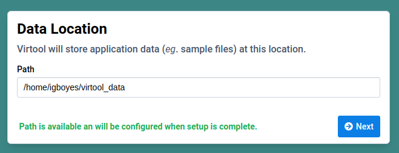



**Errors will occur if:**

-   the executing user does not have permission to write the data path
-   the data path already exists and is not empty



# Set Watch Location {#watch_path}

The primary method for making Illumina FASTQ files available to Virtool for sample creation is by uploading them through the web interface.

It is also possible to set a path accessible to the server that will be watched for new read files. Any FASTQ files dropped in this watch directory will be pulled into Virtool and made available for sample creation.

1. Review the watch location setup dialog

    By default the data path will be set to `watch` and will be created in the Virtool installation directory.

    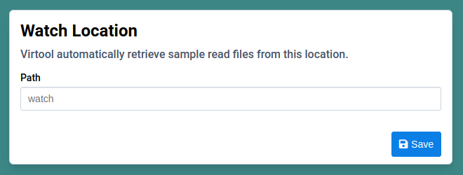

2. Set a watch location of your choosing

    An error will be returned if the location doesn't exist or Virtool doesn't have permission to write to the location.

    

3. Click the  button

    This will save the watch path to your setup configuration. The filesystem will not be modified until the server restarts.

    

# Save and Restart

1. Review the setup summary

    This shows what will happen as a result of your setup parameters.

    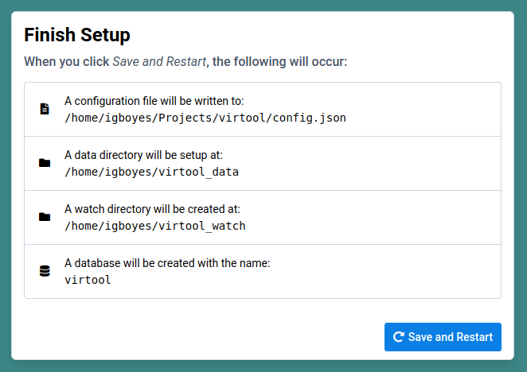

1. Click the  button

    The server will write a configuration file and restart. You will be directed to [create a first user](#create-first-user) when the restart completes.

    

# Create First User

Once the server has been setup, you have to create an first user. This user will be automatically given an administrative role.


We strongly recommend **not** making the first account a generic administrative account.

Doing so defeats Virtool's built-in auditing, which is designed in accordance with [ISO 17025:2005](https://www.iso.org/standard/39883.html). Each account should correspond to an individual user. Make yourself the first user.


1. This form will appear if no users are present in the configured database:

    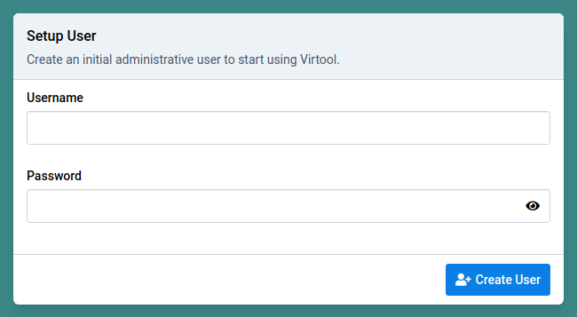

2. Fill out the form with a username and password

    This user will be an administrator.

    

3. Click the  button

    The application will load and you will be automatically logged in as the new user.

    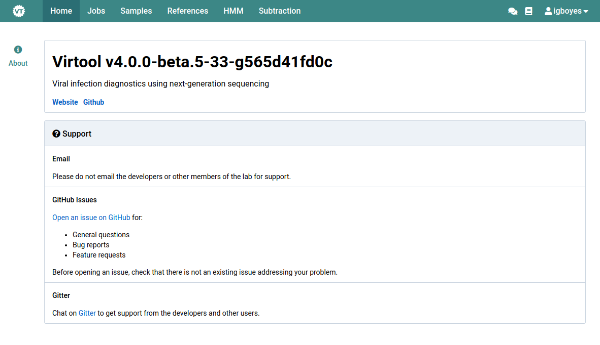
